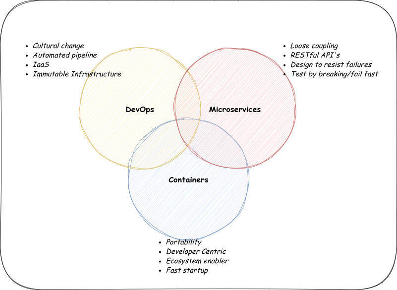
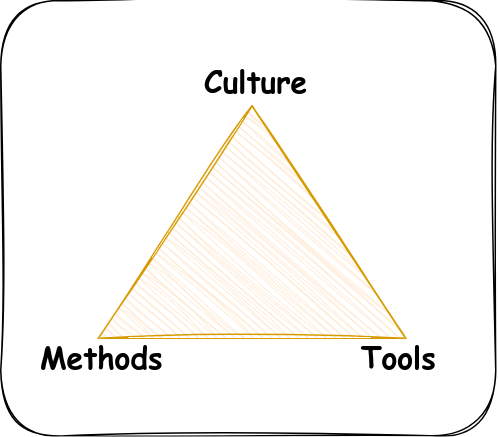

# Revolutionizing the Way We Build: A Deep Dive into DevOps

In this blog, we’ll explore the core aspects of DevOps, including the cultural changes required for success, the importance of teamwork, and the role of continuous integration and delivery. We’ll also delve into how DevOps drives innovation by emphasizing organizational learning, accountability, and actionable metrics to improve efficiency and product design.

<i>The content of this blog is based on the key points and notes I gathered while completing the [IBM Introduction to DevOps](https://www.coursera.org/learn/intro-to-devops) course on Coursera. I found the course to be highly insightful and wanted to share what I learned to help others understand the fundamentals of DevOps.</i>

---

## Definition of DevOps:

DevOps is a practice of development and operations engineers working together through the entire Software Development Life Cycle, following lean and agile principles that allow them to deliver software in rapid and continous manner.

---

## How do you change your culture:

- Think differently
  - Social Coding
  - Working in small batches
  - Minimum Viable Product (MVP)
- Work differently
  - Test Driven Development (TDD)
  - Behhaviour Driven Development (BDD)
  - Continous Integration / Continous Deployment (CI/CD)
- Organize differently
  - Organization impacts design
- Measure differently
  - Measure what matters
  - YOU GET WHAT YOU MEASURE

**Think Differently**: With the emphasis on collaborative coding through Social Coding, this promotes openness and shared learning. Teams work on small batches to ensure speed of feedback and ability to adapt. Building a Minimum Viable Product allows fast iteration and validation.

**Work Differently**: TDD, BDD emphasizes quality from the beginning, while CI/CD fulfills automation to ensure faster and reliable software delivery.

**Organize Differently**: The architecture of an organization directly influences systems design. Alignment of teams is done in a way to ensure results are better achieved and less complex.

Measure Differently: You get what you measure; hence, it's essential to measure the outcomes that matter. Concentration on the right metrics drives continuous improvement behavior.

---

## What DevOps is about?

Effective DevOps is founded on several practices that form the backbone of collaboration and productivity.

- **Teamwork:**
  Teamwork is very important because it creates a space where everybody works together towards common goals.
- **Accountability:**
  Accountability ensures that individuals feel a sense of responsibility for their contributions and outcome, hence possess ownership.
- **Trust:**
  Trust among team members and departments is the helpful environment where ideas can be shared openly and problems solved.
- **Transperency:**
  Transparency in processes and decisions helps in aligning team efforts and clarifies expectations.
- **Communication:**
  Communication is really important for coordinating activities and for sharing very important information right away.
- **Co-Ordination:**
  Co-ordination makes sure that all parts of the team work well together, reducing conflicts and making workflows smoother.

All these parts together create an efficient and great DevOps culture and enhance general performance and success.

---

## Business case for DevOps:

**Digitialization** + **Business Model**

> _Technology is the **enabler** of INNOVATION ..... not **driver**_

Technology provides the tools and platforms needed for innovation. But it is in how businesses use these technologies in order to create new chances, work better, and provide more value that truly lies the key to successful change. This way, an organization can focus its endeavors on the use of technology in a smart manner as a facilitator of creativity toward true growth.

---

## DevOps an extension!

> "The term 'Development Operations' is an extension of Agile development environment that aim to enhance the proless of software delivery as a whole."
<b><i>- Patrick Debois, 2009</i></b>

Let me explain, Imagine you are making this really cool toy, but you are doing it with your friend. One of you is in charge of making the pieces, and the other is in charge of putting the toy together. Now, if you both work together super well, you can make the toy really fast and with fewer mistakes.

DevOps, in general, is like one big development process that helps you and your friend work together more effectively. It takes this other thing called "Agile," which is just a way to build things quick, and adds more collaboration within a team. The idea is to make everything run smoothly from making the pieces-launching the software-to putting it all together so the toy gets done faster and better!

---

## Agility: The three pillars:

---

## The Perfect Storm:

- **DevOps** for Speed & Agility:\
  Using this, organizations can move rapidly and flexibly using the ideal connection between development and operations, by focusing on continuous integration and automating tasks. This process accelerates software delivery with high quality.

- **Microservices** for small deployments:\
  Helps DevOps by letting applications be divided into small, independent services. This means applications can be easier, separate updates, and more straightforward maintenance-keeping applications growing more effectively and stronger.
- **Containers** for ephemeral runtimes:\
  Are actually an excellent context to provide for the ephemeral runtime environment, so that each microservice is run similarly elsewhere. They provide rapid creation and scaling, thus fitting well for highly flexible and distributed systems.

---

## Three Dimensions of DevOps

> "Culture is **#1** success factor in DevOps. Building culture of shareed responsibility, transperency and faster feedback is foundations of every high performing DevOps team."
<b><i>- Atlassian</i></b>

Let me think of DevOps in terms of a sporting team. Winning the game requires more than just good athletes (such as tools or technology); teamwork needs to be great, too.

Culture is like that team spirit-how everyone communicates and supports and takes responsibility for the game. In DevOps, this means:

**Shared responsibility**: People tackle problems as a team rather than placing blame elsewhere.

**Openness**: Everybody knows what is happening so that there are no surprises.

**Quick feedback**: You don't have to wait long to know if you're doing well or if you need to get better. The DevOps team will succeed if they come with a good team and a good culture, and will improve.

> _While **tools** & **methods** are important...  it's the **culture** that has the biggest impact_

---

## Leading up-to DevOps

- Architects would worked for months designing the system
- Development worked for months on feature
- Testing opened defects and sent code back to development
- At some point, the code is released to productions
- The operations team took forever to deploy. _(As they didnt know what developers has built)_

Before DevOps, it was more like a relay race making software: a long time by architects to design the system; then a lot of effort put into building features by developers, and finally, testers looked for problems and sent the code back for more fixes. It was not easy to deploy at the time of its release; the operations people couldn't know what the developers had done. That would have caused delays and problems most of the time, and so, to make it all work together much easier, this is where DevOps comes into the picture.

## Conclusion

In today’s fast-paced digital landscape, DevOps represents a transformative approach to software development and operations, emphasizing collaboration, efficiency, and continuous improvement. By breaking down traditional silos and fostering a culture of shared responsibility, DevOps integrates development and operations teams to streamline the entire software lifecycle.

🌟 Some key notes from the blog:

- We "don't" do DevOps\ We "become" DevOps
- Technology is enabler of innovation .... not driver
- One Word, One Team, One set of measurements
- Culture is #1 success factor in DevOps
- While tools and methods are important\ .... its culture that has the biggest impact
